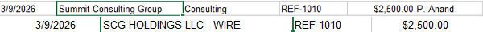

***Company Ledger x Bank Reconciliation Investigation:***
# *Riverside Bike Co Reconciliation Case*

> ### **About This Project**

The goal of this audit/reconciliation was to compare the bank statements to the company ledger and master vendor list to weed out any discrepancies that had a cause for concern. Assuming any concerns would arise, an investigation would be conducted with the conclusion resulting in recommended corrective actions.

This project was created with simulated data and the intention to practice forensic & investigative accounting-not only to match numbers and find discrepancies, but to explain *why* it happened and *how* to fix them.

---

## Key Findings
*These are the key findings that were a cause for concern before the detailed report follows.*

- **#1** ~ Summit Consulting Group - Not an approved vendor & ledger and bank transaction name doesn't match.
- **#2** ~ City Water & Sewer - Bookkeeping error
- **#3** ~ City Water & Sewer - Costing red flag
- **#4** ~ City Water & Sewer - Frequency red flag
- **#5** ~ Metro Electric Co - Frequency red flag
- **#6** ~ Sunrise Payroll Services - Frequency red flag
- **#7** ~ OUTGOING WIRE - REF UNKNOWN - Not Recorded In Ledger & Unknown Vendor
- **#8** ~ ZELLE TRANSFER - D. KIM - Not Recorded In Ledger & Unknown Vendor
- **#9** ~ QUICKCLEAN JANITORIAL - Charged twice in the month

---

## Investigation Detailed Report

### #1 ~ Summit Consulting Group 
- *Unapproved Vendor & ledger/bank transaction **name** doesn't match*

[Extended Description] - $2500 payment with REF-1010 not in vendor master & the bank's transaction name doesn't match the company's ledger. 

#### [Reason For Concern]
- With the $2500 transaction not being in the approved vendors list, the validity of the transaction is of concern.

- Additionally, the name on the bank's transaction not matching the one recorded in the company ledger is a small error that could potentially cause confusion and mismatches when searching for the transaction.

#### [Recommended Action]
- Follow up with the vendor to approve the transaction valid & reconcile the name difference in the company ledger to match the bank statement.

 

---

Skills Demonstrated ~ 
Bank reconciliation, 
discrepancy analysis, 
fraud pattern recognition, 
written findings.

Found 6/6 planted issues incl. a shell-vendor name mismatch; 
wrote full findings + summary memo.

Time Spent ~2 hrs.

Status ~ Completed
